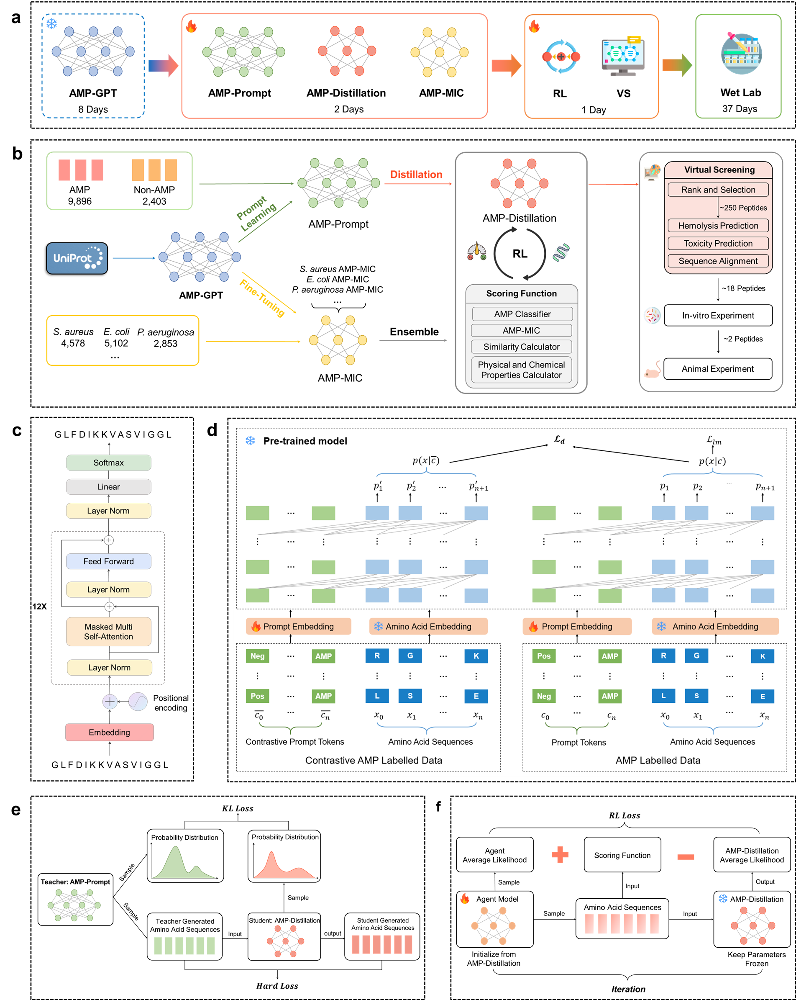

# Discovery of novel antimicrobial peptides with notable antibacterial potency by a LLM-based foundation model
<div align=center>

</div>

### Python Dependencies
```
Python >= 3.8
Pytorch >= 1.13.1
RDKit >= 2022.09.1
transformers >= 4.24.0
pandas >= 1.5.3
scipy == 1.10.0
```

## Pretrained Model
The weight and configuration files of pre-trained model can be found in [Zenedo](https://zenodo.org/records/13999508).

## Generation
AMP_GPT_generator.py can be used for generation. 
